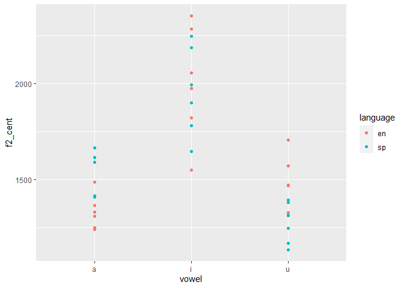

README
================
Monica Impaglia
2022-04-04

``` r
library("ggplot2")  
```

    ## Warning: package 'ggplot2' was built under R version 4.1.3

``` r
library("readr")  
```

    ## Warning: package 'readr' was built under R version 4.1.3

``` r
library("here")  
```

    ## Warning: package 'here' was built under R version 4.1.3

    ## here() starts at C:/Users/Home/OneDrive/Desktop/pa_3

``` r
library("tidyverse") 
```

    ## Warning: package 'tidyverse' was built under R version 4.1.3

    ## -- Attaching packages --------------------------------------- tidyverse 1.3.1 --

    ## v tibble  3.1.6     v dplyr   1.0.8
    ## v tidyr   1.2.0     v stringr 1.4.0
    ## v purrr   0.3.4     v forcats 0.5.1

    ## Warning: package 'dplyr' was built under R version 4.1.3

    ## Warning: package 'forcats' was built under R version 4.1.3

    ## -- Conflicts ------------------------------------------ tidyverse_conflicts() --
    ## x dplyr::filter() masks stats::filter()
    ## x dplyr::lag()    masks stats::lag()

``` r
library("dplyr")
```

# **Answers to question 7:**

## a) By subtracting the starting point of the interval from the end point of the interval, we will have the duration. For each percentage we have to multiply the percent by the duration.

## b)The script starts by locating where the sound and text grid files are located. It then identifies each interval and extracts the item, value and language. It then gets the formants at each specified interval, calculates spectral centroids and trajectory lengths. Lastly the script shows the data values in a praat window and saves the same data to a csv file as an excel spreadsheet.

## c) In the last programming assignment, we had to use two different scripts, one to seperate the stimuli and one to extrapolate the data from the textgrids that had to be done individually. In this assignment we had one script that did all of it and allowed us to seperate all the intervals in one textgrid. This script seems to be more efficient and also gives us more information than the last one.

``` r
args(read.csv)  
```

    ## function (file, header = TRUE, sep = ",", quote = "\"", dec = ".", 
    ##     fill = TRUE, comment.char = "", ...) 
    ## NULL

``` r
read.csv(file = "C:\\Users\\Home\\OneDrive\\Desktop\\pa_3\\data\\vowel_data.csv") 
```

    ##    id   item vowel language f1_cent f2_cent      tl   f1_20   f1_35   f1_50
    ## 1  MI   meet     i       en  375.62 2284.03 1272.91  332.94  376.98  385.85
    ## 2  MI   beat     i       en  369.85 2057.76 3742.00  365.26  382.58  441.75
    ## 3  MI   feet     i       en  644.61 2352.66 2188.44  859.97  389.82  350.06
    ## 4  MI   seat     i       en  728.49 1975.30 3547.28 1537.78  399.77  402.87
    ## 5  MI   heat     i       en  592.61 1821.64 4832.33  877.97  432.11  322.94
    ## 6  MI  fleet     i       en  385.23 1550.71 4069.35  377.23  398.11  297.90
    ## 7  MI   moss     a       en  761.20 1330.93 1006.07  679.01  811.49  638.00
    ## 8  MI    bot     a       en  964.87 1365.75  369.04  983.62 1069.73  947.47
    ## 9  MI faught     a       en  671.94 1487.03 1160.11  550.06  652.65  716.80
    ## 10 MI bought     a       en  867.57 1309.65 2301.91 1485.60  592.87  724.91
    ## 11 MI caught     a       en  669.27 1239.50  960.46  395.37  605.83  809.74
    ## 12 MI sought     a       en  669.76 1250.53  677.90  463.74  656.94  676.51
    ## 13 MI   moot     u       en  400.16 1468.73 1667.82  382.49  407.44  389.78
    ## 14 MI   boot     u       en  419.08 1472.81 1354.25  401.06  429.04  454.60
    ## 15 MI   food     u       en  383.21 1326.92  872.13  365.77  392.25  428.82
    ## 16 MI soothe     u       en  437.31 1706.77  756.23  493.68  477.75  390.53
    ## 17 MI  cooed     u       en  379.87 1314.32  860.34  350.14  405.38  377.87
    ## 18 MI   dude     u       en  419.16 1571.51  671.43  409.60  388.00  418.46
    ## 19 MI    mis     i       sp  429.59 2246.31 2726.45  390.64  501.53  342.23
    ## 20 MI    bis     i       sp  654.32 2186.66 2824.97  422.85  388.84  444.31
    ## 21 MI    pis     i       sp  473.99 1993.58 3105.35  296.84  394.86  369.84
    ## 22 MI   cito     i       sp  707.38 1781.64 3220.45 1296.39  307.66  518.80
    ## 23 MI   fito     i       sp  631.10 1900.92 2341.22  361.43  388.19  964.08
    ## 24 MI  quito     i       sp  458.13 1647.14 2306.17  301.80  305.87  232.84
    ## 25 MI    mas     a       sp  931.09 1666.02 1325.70  506.21 1021.70  961.14
    ## 26 MI    vas     a       sp  869.84 1615.24  826.72  886.64 1018.05  780.45
    ## 27 MI   pasa     a       sp  935.95 1409.13 1580.41 1037.79  761.37  947.71
    ## 28 MI   sala     a       sp  832.69 1590.89  953.40  903.05  862.47  715.00
    ## 29 MI   fama     a       sp  919.11 1410.58  684.85  941.64  964.54 1040.44
    ## 30 MI   cama     a       sp  697.63 1415.32 1821.77  905.58  457.28  844.24
    ## 31 MI   musa     u       sp  563.87 1393.68 1820.28  479.17  386.27  526.47
    ## 32 MI  bulto     u       sp  472.62 1167.61  932.84  413.09  344.35  406.01
    ## 33 MI   puso     u       sp  486.43 1245.42 1966.88  406.72  561.02  397.18
    ## 34 MI   supo     u       sp  561.70 1135.12 1573.78  936.29  436.55  253.75
    ## 35 MI   fumo     u       sp  574.85 1379.32 1723.28  702.35  599.84  269.91
    ## 36 MI   cura     u       sp  579.41 1312.76 1306.47  405.53  537.08  646.03
    ##     f1_65   f1_80   f2_20   f2_35   f2_50   f2_65   f2_80
    ## 1  385.06  397.27 1566.02 1853.10 2359.77 2808.69 2832.55
    ## 2  355.76  303.89 2076.59 2700.29 1992.20 1036.41 2483.33
    ## 3  823.43  799.79 2125.32 2745.91 2754.07 2479.96 1658.03
    ## 4  329.30  972.75 2072.40 2365.06 2071.46 1184.25 2183.34
    ## 5  286.63 1043.38 2661.17 2465.93  331.55 1776.68 1872.87
    ## 6  299.51  553.38 1219.65 2112.78 1884.63  505.10 2031.38
    ## 7  886.14  791.33 1003.85 1068.49 1197.86 1651.03 1733.40
    ## 8  929.23  894.33 1324.03 1371.00 1441.18 1365.86 1326.66
    ## 9  739.52  700.65  973.51 1197.19 1575.15 1595.23 2094.05
    ## 10 775.74  758.75 1901.30 1209.97 1093.54  815.02 1528.45
    ## 11 882.16  653.25  959.58 1063.84 1422.28 1412.04 1339.75
    ## 12 710.48  841.11 1047.84 1092.71 1227.17 1366.64 1518.28
    ## 13 361.89  459.18 1779.94 1066.08 1286.18 1261.43 1950.03
    ## 14 309.56  501.16 1253.28 1181.89 1609.54 1384.97 1934.35
    ## 15 425.90  303.31 1387.69 1289.27 1176.36 1527.67 1253.62
    ## 16 401.62  422.97 1901.19 2026.85 1740.50 1431.88 1433.42
    ## 17 417.41  348.54 1180.47 1228.41 1108.88 1289.66 1764.17
    ## 18 429.70  450.05 1870.25 1690.87 1438.29 1354.07 1504.07
    ## 19 300.85  612.73 1621.59 2800.30 2870.48 1871.42 2067.76
    ## 20 474.90 1540.68 2674.21 1598.25 2209.16 2157.06 2294.62
    ## 21 300.50 1007.90 2193.56 2547.98 1224.69 1899.20 2102.45
    ## 22 900.95  513.09 1914.18 2679.69 1960.16 1289.18 1065.01
    ## 23 852.83  588.97 2242.58 2554.58 2357.53 1227.88 1122.04
    ## 24 847.79  602.34 2421.45 2446.87 1062.58 1200.89 1103.93
    ## 25 948.90 1217.51 1359.78 1484.05 1537.66 1780.79 2167.84
    ## 26 907.49  756.60 1455.99 1495.36 1515.14 1762.45 1847.23
    ## 27 862.43 1070.45 1489.27 1060.16 1641.46 1565.01 1289.77
    ## 28 756.03  926.92 1875.95 1447.36 1629.77 1530.74 1470.63
    ## 29 956.96  691.99 1365.40 1335.96 1550.69 1483.20 1317.64
    ## 30 979.27  301.77 1500.38 1491.17 1330.11 1511.19 1243.78
    ## 31 732.15  695.31  787.60 1413.69 1950.60 1449.95 1366.57
    ## 32 579.41  620.23  838.82 1379.86 1332.01 1133.37 1153.97
    ## 33 575.83  491.41  823.01 1619.04 1792.47 1074.30  918.28
    ## 34 614.34  567.57 1686.88 1031.56  943.49 1083.33  930.34
    ## 35 802.69  499.46 1935.51 1620.36 1442.14  972.82  925.76
    ## 36 825.63  482.79  802.60 1234.28 1533.98 1472.02 1520.94

``` r
vowel_data <- read.csv("C:\\Users\\Home\\OneDrive\\Desktop\\pa_3\\data\\vowel_data.csv")  
```

``` r
mean(vowel_data[vowel_data$language == 'en', 'f1_cent'])
```

    ## [1] 563.3228

``` r
mean(vowel_data[vowel_data$language == 'sp', 'f1_cent'])
```

    ## [1] 654.4278

``` r
mean(vowel_data[vowel_data$language == 'en', 'f2_cent'])
```

    ## [1] 1604.808

``` r
mean(vowel_data[vowel_data$language == 'sp', 'f2_cent'])
```

    ## [1] 1583.186

``` r
ggplot(data = vowel_data, aes(x = vowel, y = tl, color = language)) + 
  geom_point()  
```

<!-- -->

``` r
ggplot(data = vowel_data, aes(x = vowel, y = f1_cent, color = language)) +  
  geom_point()
```

<!-- -->

``` r
ggplot(data = vowel_data, aes(x = vowel, y = f2_cent, color = language)) +  
  geom_point()
```

<!-- -->

``` r
vowel_means <- vowel_data %>% 
  group_by(vowel, language) %>% 
  summarize(f1_cent = mean(f1_cent), f2_cent = mean(f2_cent)) %>% 
  ungroup() %>% 
  mutate(order = case_when(vowel == "i" ~ 1, vowel == "a" ~ 2, TRUE ~ 3), 
         vowel = forcats::fct_reorder2(vowel, vowel, order)) %>% 
  arrange(order)
```

    ## `summarise()` has grouped output by 'vowel'. You can override using the
    ## `.groups` argument.

``` r
vowel_data %>% 
  mutate(vowel = forcats::fct_relevel(vowel, "u", "a", "i")) %>% 
  ggplot(., aes(x = f2_cent, y = f1_cent, color = language, label = vowel)) + 
    geom_text(size = 3.5, alpha = 0.6, show.legend = F) + 
    geom_path(data = vowel_means, aes(group = language, lty = language), 
              color = "grey") + 
    geom_text(data = vowel_means, show.legend = F, size = 7) + 
    scale_y_reverse() + 
    scale_x_reverse() + 
    scale_color_brewer(palette = "Set1") + 
    labs(title = "Vowel space comparison", 
         subtitle = "Spectral centroids of English/Spanish cardinal vowels", 
         y = "F1 (hz)", x = "F2 (hz)") + 
    theme_minimal(base_size = 16)
```

<!-- -->
